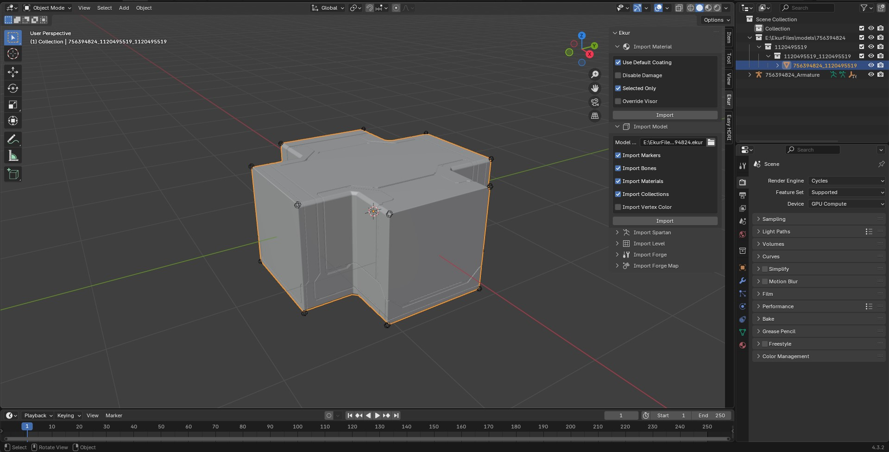
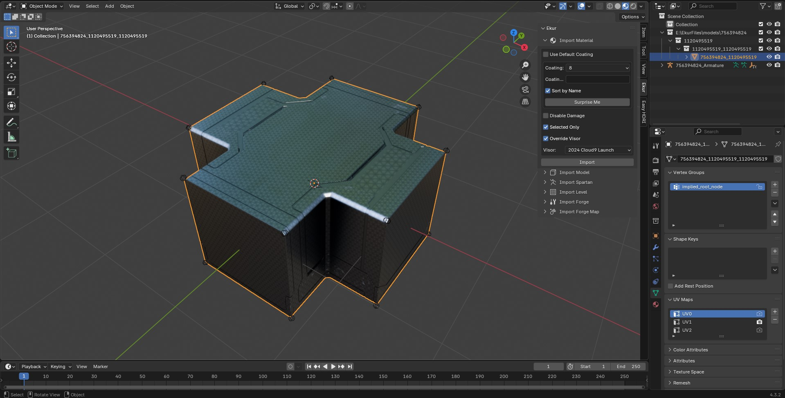
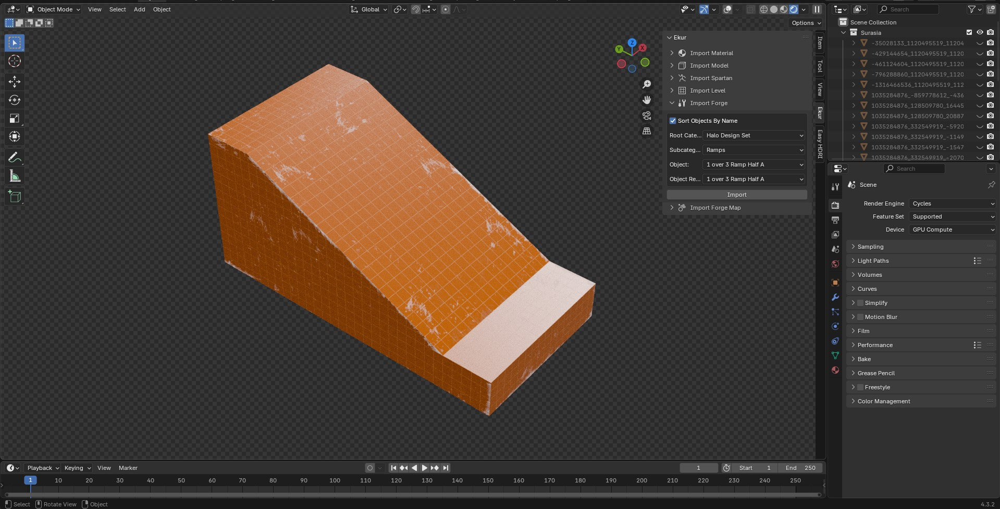
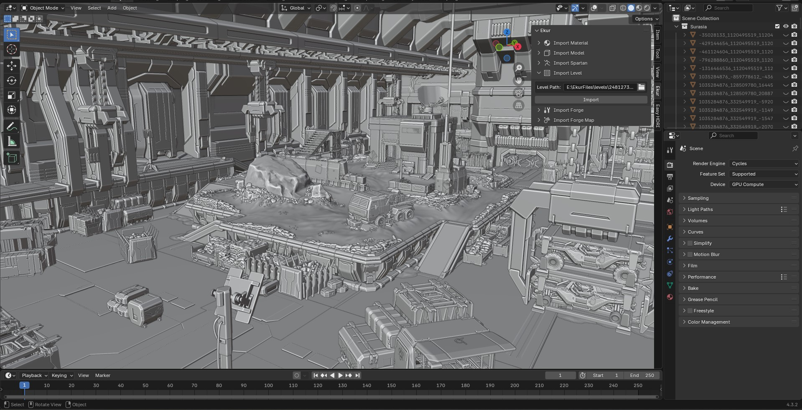

Ekur
===
A multi-purpose blender importer for Halo Infinite.

### Requirements
- [Blender 4.3 or Above](https://www.blender.org/download/)
- Windows or Linux/GNU 64-bit machine.
- An installation of Halo Infinite.

### Supporting
If you want to support the work I do, please consider buying me a coffee: https://ko-fi.com/surasia

### First-Time Installation/Setup
Download the zip file included in the [latest release](https://github.com/Surasia/Ekur/releases/latest) and install it by going into Blender preferences (Edit < Preferences), navigating to "Add-ons" and clicking on the "Install from disk" button in the drop-down menu.

Once the addon is installed, open the drop down for the "Ekur" addon and set your paths.
- Data Folder: Location to where files should be extracted. Make sure that the drive containing this folder has at least 30GBs of storage.

- Deploy Folder: This is a folder inside the installation directory for Halo Infinite, called "deploy". You can find your installation folder by clicking "Browse Local Files" in the context menu for the game in Steam.

> [!IMPORTANT]
> Make sure to enable the "Allow Online Access" option under "System" in Blender's preferences menu!
> Please also note that Windows Defender (sigh) can pick up the ekur executable when it is downloaded via the "Download Required Files" button, this is a false positive.

After you're done setting your paths, click the "Download Required Files" button. This will download the latest build of Ekur for your platform, alongside the strings and visor definition files.

> [!TIP]
> Extracting files can take a long time depending on your system configuration.
> While extraction, Blender will temporarily freeze up (this may take 5-30 minutes).

Once the required files are downloaded, click the "Dump Required Files" button. This will run the main tool that extracts and serializes data from the game into a common format that the addon can use, alongside extracting all required bitmaps that the addon can utilize.

### Features/Usage
The addon can be accessed from the Blender sidepanel, which can be viewed by pressing "N" in the 3D Viewport.

#### Model Importer
<h1 align="center">
  <picture>
    
  </picture>
</h1>

Ekur can import models extracted from the game using its own model format, `.ekur`. To import a file, open up the "Import Model" panel in the sidepanel, and select a model from the "models", "runtime_geo" or "particle_model" folders of your data directory from the installation part. Here you can select these options:
- `Import Markers`: Whether to import markers as empties or not. These markers are basically different "anchors" parented to your model which determine things like where the game should put weapons when they're unequipped, alongside providing location/rotation info for where attachments should go in spartans.
- `Import Bones`: Whether to import armatures/weights for models. Please do note that these are from the game and could have issues, such as with bone placements.
- `Import Materials`: Whether to create material slots in meshes.
- `Import Collections`: Whether to sort meshes into collections. By default, a "root" category named after the model is created, with permutations as subcategories, and with regions inside those.
- `Import Vertex Color`: Whether to import vertex color (ID) for meshes that support it. By default, this is disabled as it can be very slow to import.

#### Material Importer
<h1 align="center">
  <picture>
    
  </picture>
</h1>
Some materials can also be imported using Ekur, such as skin, decals and layered coatings. Simply select an object in the viewport, and click on the "Import" button under the "Import Material" panel. In the menu, you can also customize the material you want to import.

For layered shaders (such as Spartans or Weapons):
- `Use Default Coating`: For most materials, you'll want to leave this on, as it automatically selects the material a model should use. However, for importing coatings, you can untick this and use the `Coatings` drop down menu to select the coating you want to import.
- `Coating`: Drop down menu to select the coating you want to import. For spartans, weapons and vehicles, these should be named automatically using definitions from cylix.guide, but may be hard to navigate.
- `Coating ID`: This is a more advanced option and won't do anything if left empty, but allows for inputting coating IDs directly from the infinite API.
- `Sort By Name`: Sorts coating names by their names, on by default.
- `Disable Damage`: This disables the 7th or 4th zone, commonly used for an extra layer of grime/wear/damage on armor. If you prefer a cleaner look for your models, select this.
- `Override Visor`: Unticking this allows you to access the `Visor` drop down menu, which will apply the selected visor pattern to helmet visors.
The `Surprise Me` button will select a random coating that is available on the model, useful if you're unsure on what to use.

For both layered and regular materials:
- `Selected Only`: Only imports materials on selected objects if ticked, otherwise applying coatings to every model in the scene.

#### Spartan Importer
<h1 align="center">
  <picture>
    
  </picture>
</h1>

A common use case for the addon is of course, to create renders of your spartans. Ekur allows you to import both all armor pieces together (Import Spartan button), sorted by core, or to import a specific spartan by specifying a gamertag (Import Spartan From Gamertag button). Options included:
- `Use Purp's Rig`: Whether to use purplmunkii's amazing IK/FK control rig instead of the in-game FK rig for imported spartans. This is recommended if you are aiming to animate or pose a spartan.
- `Import Specific Core`: When enabled, allows you to select the specific core you want to import (such as Yoroi, Mark VII).
- `Import Names of Armor Pieces`: Enabled by default, allows translation hashes of armor pieces into their proper names.
- `Gamertag`: Xbox username of the spartan you want to import. Please note that only the currently equipped spartan can be imported.
+ all the different prosthetic options for each limb.

#### Forge Importer
<h1 align="center">
  <picture>
    
  </picture>
</h1>

Ekur can also import forge objects using a menu similar to the game, automatically choosing the default coating for the selected forge objects. Please note that due to the nature of Infinite's forge mode most objects look a bit flat, and not all objects have materials as of this release.

#### Experimental: Level Importer
<h1 align="center">
  <picture>
    
  </picture>
</h1>

Map geometry from multiplayer maps (non-forge, as of now) can also be imported by selecting a json file inside the "levels" directory of your data folder, but materials and props are currently not supported.

### FAQ
#### Are campaign assets supported?
Yes! However, you do need to set up its own data folder and tick the "Is Campaign" option in the addon preferences, and forge import options will become unavailable.

#### Do I need to re-dump every time I want to import something?
No, you should only need to go through the first-time installation steps when updates to the addon or the game are released.

### Credits
- [cylix.guide](https://cylix.guide): Visor data
- [Chunch](https://github.com/Chunch7275) and [ChromaCore](https://bsky.app/profile/chromacore.bsky.social): Developing the Halo Infinite Modular Shader
- [Reclaimer](https://github.com/Gravemind2401/Reclaimer): Lots of the components for mesh importing.
- [purplmunkii](https://x.com/PURPL_MUNKII): Custom rig for spartans

### Special Thanks
During development, tons of amazing people on the [Halo Archive](https://discord.gg/haloarchive) have helped test and give feedback on this addon. Without them, Ekur would be much buggier and I would not have the motivation to continue work on the addon. Thank you!
